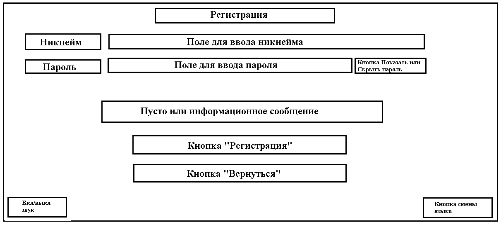
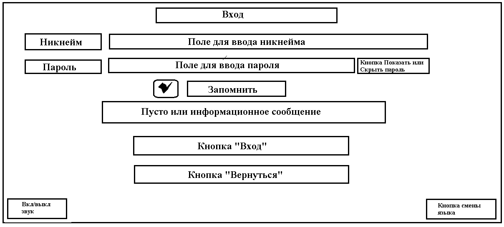
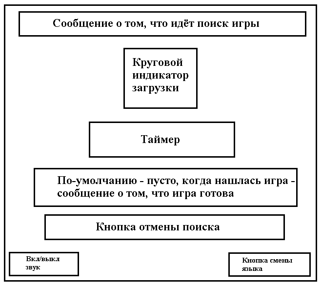

# TicTacToe online multiplayer game

#### Проект представляет из себя многопользовательскую онлайн игру "Крестики-Нолики".

У каждого пользователя имеется своя версия клиента (с графическим интерфейсом) с игрой.
Взаимодействие пользователей при поиске онлайн игры и во время игры
осуществляется через сервер посредством механизма сокетов.
При этом каждая игра проходит в отдельной комнате сокета со своим уникальным "game_id".
По завершении игры игроки удаляются из комнаты и сама комната также удаляется.

Прежде чем начать игру пользователь должен
создать свой аккаунт и залогиниться под ним. Имя пользователя и пароль хранятся на сервере,
причём пароль хранится в захешированном виде.
По-умолчанию, если пользователь не нажал кнопку выхода из аккаунта и закрыл приложение, произойдёт
автоматический выход из аккаунта. Но при входе в аккаунт имеется возможность нажать галочку
"Запомнить", что отключает автоматическое разлогинивание при закрытии приложения, то есть, если
пользователь заново откроет приложение, он сразу окажется в своём аккаунте. Также есть поддержка
скрытия или показа пароля при входе или регистрации. 

В игре имеется фоновая музыка, которую
можно отключить или включить нажатием соответствующей кнопки. Присутствует переключение языка
с английского на русский и обратно. Также нажатие на любую кнопку интерфейса сопровождается
звуком нажатия. 

В игре имеется два режима: игра против компьютера и игра по сети. Каждый из
режимов имеет свою статистику, которая хранится на сервере отдельно для каждого пользователя.
Также возможен выбор знака и очерёдности хода. 

В зависимости от исхода игры проигрывается
соответствующая исходу музыка и игровое поле окрашивается в соответсвующий исходу цвет.

При игре по сети пользователю подбирается оппонент, который тоже ищет игру и выбрал отличные
от первого пользователя знак и очерёдность хода. Во время поиска показывается таймер текущего времени
поиска и круговой индикатор загрузки. Если оппонент был найден, то появляется
соответствующее сообщение, проигрывается звук того, что нашлась игра и открывается игровое поле.
Далее в течении некоторого времени происходит ожидание оппонента. Если оппонент не смог 
подключиться к игре, то вам засчитывается победа, но оппоненту поражение не засчитывается.

Проверка победы кого-либо из игроков происходит на стороне клиента.

Поиск можно отменить нажатием соответсвующей кнопки. Игру также можно отменить, но при этом
вам засчитывается поражение, а противнику - победа, даже если вы не отменили игру, а просто
закрыли приложение. Поиск игры также отменяется при
закрытии приложения. Игру с компьютером нельзя отменить, но при закрытии приложения во время игры
вам засчитывается поражение.

Предполагается, что сервер бесперебойный и всегда включен.
  
### Стек технологий:
Python, Tkinter, PyGame, Flask, Flask-SQLAlchemy, Flask-SocketIO, threading, SocketIO, PyJWT,
requests, Babel (gettext), Pillow, Sphinx, Gunicorn, Docker, docker-compose, pyinstaller, doit,
setuptools, serveo.net
  
### Документация:
Программная:&nbsp;&nbsp;&nbsp;&nbsp;&nbsp;https://online-tictactoe.readthedocs.io/en/latest/tech_doc.html  
Пользовательская:&nbsp;&nbsp;&nbsp;&nbsp;&nbsp;https://online-tictactoe.readthedocs.io/en/latest/user_guide.html
  
### Графический интерфейс:
 

<b>Стартовая страница</b>

Если пользователь не залогинен, то при открытии приложения он пападает на эту страницу

    

При нажатии на кнопку регистрации пользователь попадает на [страницу регистрации](#2).  
При нажатии на кнопку входа пользователь попадает на [страницу входа](#3).

  

<b>Страница регистрации</b>

    

Информационное сообщение показывается только при возникновении ошибки.  
При нажатии на кнопку регистрации пользователь попадает на [стартовую страницу](#1).  
При нажатии на кнопку "Вернуться" пользователь попадает на [стартовую страницу](#1).

  

<b>Страница входа</b>

    

Информационное сообщение показывается только при возникновении ошибки.  
При нажатии на кнопку входа пользователь попадает на [страницу с выбором режима игры](#4).  
При нажатии на кнопку "Вернуться" пользователь попадает на [стартовую страницу](#1).

  

<b>Страница выбора режима игры</b>

Если пользователь нажал галочку "Запомнить" на странице входа и не нажимал кнопку выхода из
аккаунта, то при открытии приложения он пападает на эту страницу

    

При нажатии на кнопку выхода из аккаунта пользователь попадает на [стартовую страницу](#1).  
При нажатии на кнопку онлайн игры пользователь попадает на [страницу настроек онлайн игры](#5).  
При нажатии на кнопку игры с компьютером пользователь попадает на [страницу настроек игры с компьютером](#5).

  

<b>Страница настроек игры</b>

    

В случае, если это страница онлайн игры, то кнопка будет "Поиск", если это страница игры с 
компьютером - "Начать игру".  
При нажатии на кнопку "Поиск" пользователь попадает на [страницу поиска игры](#6).  
При нажатии на кнопку "Начать игру" пользователь попадает на [страницу игры с компьютером](#7).  
При нажатии на кнопку "Вернуться" пользователь попадает на [страницу выбора режима игры](#4).

  

<b>Страница поиска игры</b>

    

Когда игра нашлась, пользователь попадает на [страницу онлайн игры](#8).  
При нажатии на кнопку отмены поиска пользователь попадает на [страницу настройки онлайн игры](#5).  

  

<b>Страница игры с компьютером</b>

    

Как только пользователь попадает на эту страницу кнопка имеет надпись "Начать игру".
После нажатия кнопка блокируется, надпись меняется на "Вернуться" и начинается игра.
Когда игра закончилась кнопка разблокируется.  
При нажатии на кнопку "Вернуться" пользователь попадает на [страницу настроек игры с компьютером](#5).

  

<b>Страница онлайн игры</b>

    

Как только пользователь попадает на эту страницу кнопка имеет надпись "Отменить игру".
Когда игра закончилась кнопка меняет надпись на "Вернуться".  
При нажатии на кнопку отмены игры пользователь попадает на [страницу настроек онлайн игры](#5).  
При нажатии на кнопку "Вернуться" пользователь попадает на [страницу настроек онлайн игры](#5).

