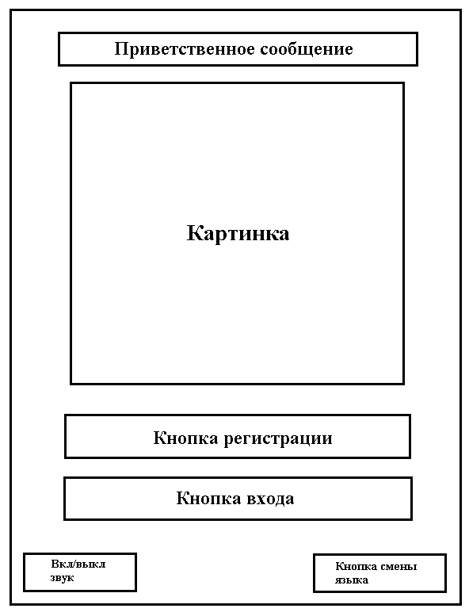
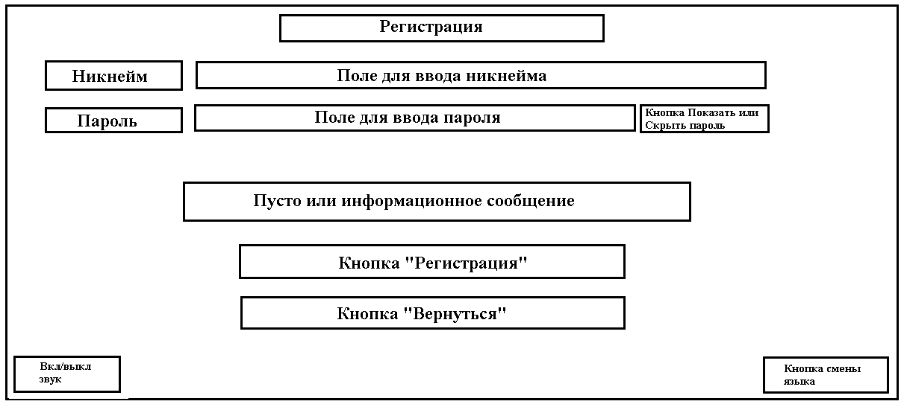
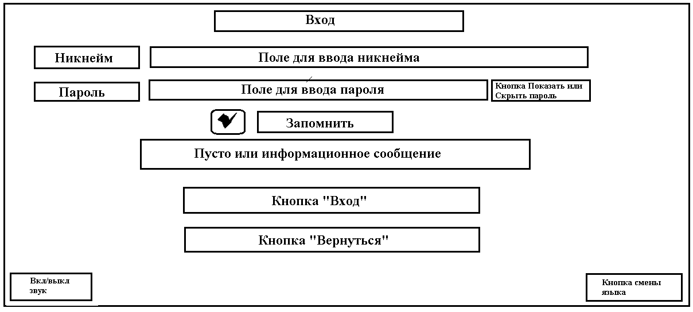
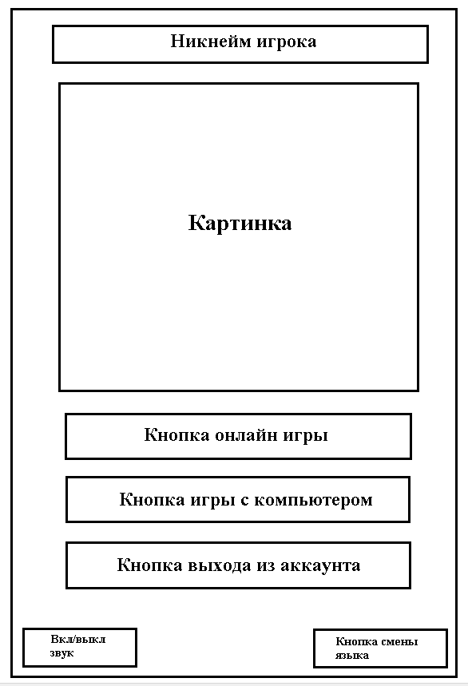
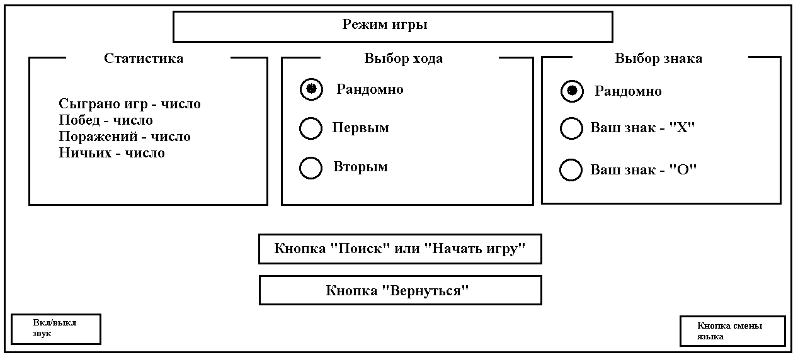
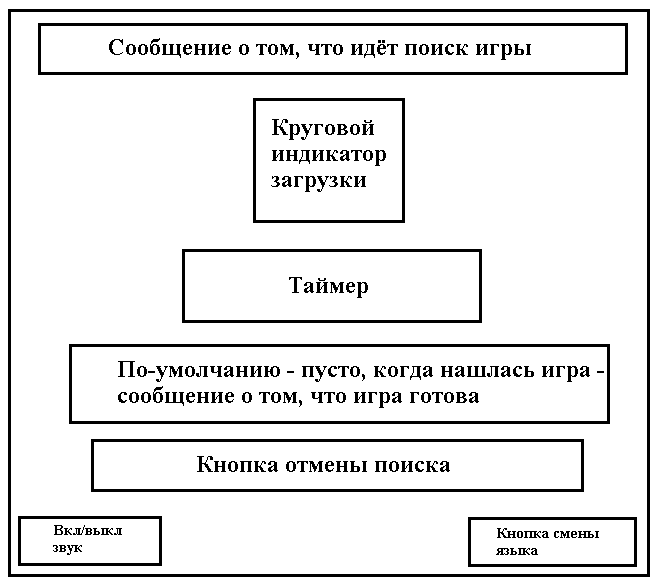
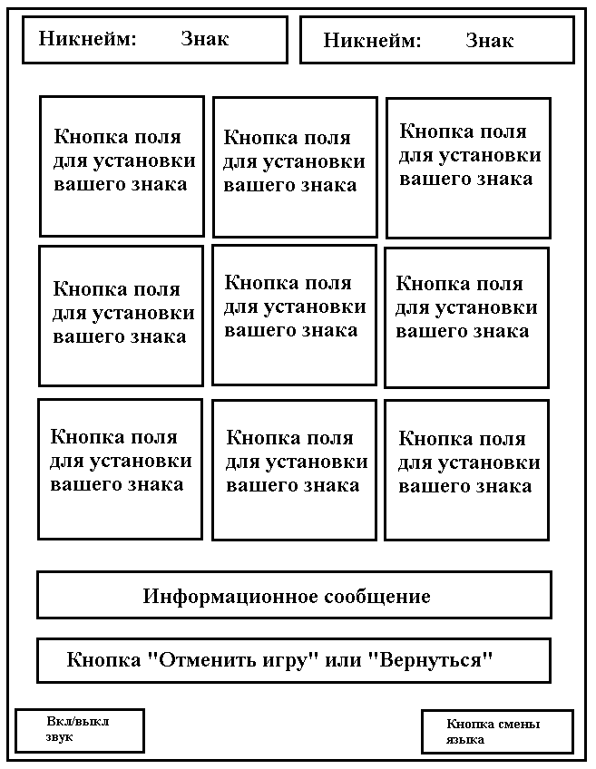

.. Online TicTacToe documentation master file, created by
   sphinx-quickstart on Sun Apr 23 21:49:15 2023.
   You can adapt this file completely to your liking, but it should at least
   contain the root `toctree` directive.

Online TicTacToe game user guide
=================================

.. toctree::
   :maxdepth: 4
   :caption: Contents:

На каждой странице игры присутствует кнопка "Включить/Выключить звук",
которая включает или отключает фоновую музыку.

На каждой странице игры присутствует кнопка смены языка, при нажатии
на которую язык интерфейса меняется с английского на русский и наоборот.

.. _start_page:

Стартовая страница
-------------------

Если пользователь не залогинен, то при открытии приложения он попадает на эту страницу

При нажатии на кнопку регистрации пользователь попадает на :ref:`страницу регистрации <register_page>`.

При нажатии на кнопку входа пользователь попадает на :ref:`страницу входа <login_page>`.

.. _register_page:

Страница регистрации
-----------------------

Для того, чтобы зарегистрироваться, пользователь должен ввести имя пользователя
и пароль.

По-умолчанию пароль, который вводит пользователь, скрыт, но пользователь может
нажать на кнопку "Показать/Скрыть пароль", чтобы увидеть пароль, который он ввёл.
Ещё одно нажатие на эту кнопку снова скроет пароль.

Если пользователь введёт никнейм, который уже зарегистрирован, то появится соответствующее
сообщение.

Если пользователь не введёт никнейм или пароль и нажмёт на кнопку регистрации, то появится
соответсвующее сообщение об ошибке.

При нажатии на кнопку регистрации аккаунт пользователя регистрируется в системе и
пользователь попадает на :ref:`стартовую страницу <start_page>`.

При нажатии на кнопку "Вернуться" пользователь попадает на :ref:`стартовую страницу <start_page>`.

.. _login_page:

Страница входа
---------------

Чтобы войти в свой аккаунт пользователь должен ввести никнейм и пароль, которые
он указал при регистрации.

По-умолчанию пароль, который вводит пользователь, скрыт, но пользователь может
нажать на кнопку "Показать/Скрыть пароль", чтобы увидеть пароль, который он ввёл.
Ещё одно нажатие на эту кнопку снова скроет пароль.

Если пользователь не введёт никнейм или пароль и нажмёт на кнопку входа, то появится
соответсвующее сообщение об ошибке.

Если пользователь введёт неверный никнейм или пароль и нажмёт на кнопку входа, то появится
соответсвующее сообщение об ошибке.

Пользователь может нажать на галочку "Запомнить", чтобы его не разлогинивало при
закрытии приложения (при условии того, что он не вышел из аккаунта
на :ref:`странице выбора режима игры <game_mode_page>`).

При нажатии на кнопку входа пользователь входит в свой аккаунт и попадает
на :ref:`страницу с выбором режима игры <game_mode_page>`.

При нажатии на кнопку "Вернуться" пользователь попадает на :ref:`стартовую страницу <start_page>`.

.. _game_mode_page:

Страница выбора режима игры
-----------------------------

Если пользователь нажал галочку "Запомнить" на странице входа и не нажимал кнопку выхода из
аккаунта на этой странице, то при открытии приложения он попадает на эту страницу

При нажатии на кнопку выхода из аккаунта пользователь выходит из своего аккаунта
и попадает на :ref:`стартовую страницу <start_page>`.

При нажатии на кнопку онлайн игры пользователь попадает на :ref:`страницу настроек онлайн игры <setting_page>`.

При нажатии на кнопку игры с компьютером пользователь попадает
на :ref:`страницу настроек игры с компьютером <setting_page>`.

.. _setting_page:

Страница настроек игры
-----------------------

В случае, если это страница онлайн игры, то кнопка будет "Поиск", если это страница игры с
компьютером - "Начать игру".

На этой странице пользователь может увидеть свою статистику сыгранных игр, а также выбрать очерёдность хода
и знак, которым он хочет играть (в зависимости от того, это страница настроек игры с компьютером
или страница настроек онлайн игры).

При нажатии на кнопку "Поиск" начинается поиск онлайн игры и
пользователь попадает на :ref:`страницу поиска игры <search_page>`.

При нажатии на кнопку "Начать игру" начинается игра с компьютером и
пользователь попадает на :ref:`страницу игры с компьютером <computer_game_page>`.

При нажатии на кнопку "Вернуться" пользователь попадает на :ref:`страницу выбора режима игры <game_mode_page>`.

.. _search_page:

Страница поиска игры
-----------------------

На этой странице отображается круговой индикатор поиска и таймер от начала поиска игры.

Пользователю подбирается оппонент, который тоже ищет игру и выбрал отличные от первого
пользователя знак и очерёдность хода.

Поиск игры отменяется при закрытии приложения.

Когда игра нашлась, показывается соответствующее сообщение, проигрывается соответствующая музыка
и пользователь попадает на :ref:`страницу онлайн игры <online_game_page>`.

При нажатии на кнопку отмены поиска игры поиск игры отменяется и
пользователь попадает на :ref:`страницу настроек онлайн игры <setting_page>`.

.. _computer_game_page:

Страница игры с компьютером
-----------------------------

Как только пользователь попадает на эту страницу кнопка имеет надпись "Начать игру".

После нажатия кнопка блокируется, надпись меняется на "Вернуться" и начинается игра.

Чтобы сделать ход, пользователь должен нажать на одну из доступных кнопок игрового поля.

Когда игра закончилась, кнопка "Вернуться" разблокируется, обновится статистика игры с компьютером.

В зависимости от исхода игры показывается соответствующее сообщение,
поле окрашивается в соответствующий цвет и проигрывается соответствующая музыка.

При нажатии на кнопку "Вернуться" пользователь попадает на :ref:`страницу настроек игры с компьютером <setting_page>`.

Отменить игру с компьютером невозможно.

Если пользователь закрыл приложение во время игры с компьютером, то ему засчитывается поражение.

.. _online_game_page:

Страница онлайн игры
-----------------------

Как только пользователь попадает на эту страницу в течении некоторого времени происходит ожидание оппонента, о чём
сигнализирует соответствующее сообщение. Кнопка имеет надпись "Отменить игру". Если оппонент не смог подключиться
к игре, то вам засчитывается победа, но оппоненту поражение не засчитывается.

Игру можно отменить нажатием на соответствующую кнопку, но при этом вам засчитывается поражение, а противнику - победа,
даже если вы не отменили игру, а просто закрыли приложение.

После подключения обоих игроков информационное сообщение показывает информацию о том,
чей сейчас ход.

Чтобы сделать ход, пользователь должен нажать на одну из доступных кнопок игрового поля. Далее происходит
ожидание хода оппонента.

Если оппонент покинул игру, то показывается соответствующее сообщение, проигрывается музыка победы
и игра завершается вашей победой.

Когда игра закончилась кнопка меняет надпись на "Вернуться".

В зависимости от исхода игры показывается соответствующее сообщение,
поле окрашивается в соответствующий цвет и проигрывается соответствующая музыка.

При нажатии на кнопку отмены игры пользователь попадает на :ref:`страницу настроек онлайн игры <setting_page>`.

При нажатии на кнопку "Вернуться" пользователь попадает на :ref:`страницу настроек онлайн игры <setting_page>`.
